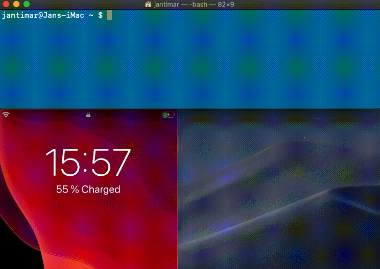

# lola

[](https://swift.org/package-manager)

[](https://twitter.com/i_binaries)

A helper tool for sending push notifications from the terminal written in **Swift**.



## Instalation

### As a Command Line Tool

If you want to run **lola** in the terminal, clone the repo:

```
$ git clone https://github.com/industrialbinaries/lola
$ cd lola
```

And then install it with Make:
```
$ make install
```

###  As a Swift Package

`lola` is also distributed via SPM. You can use it as a framework in your `macOS` or `iOS` project. 
In your `Package.swift` add a new package depedency: 
```
.package(
    url: "https://github.com/industrialbinaries/lola",
    from: "0.1.0"
)
```

## Usage

### From Terminal

To send push notifications from the terminal with **lola** you need to use the following parameters:
 
- `bundleId` - bundle the ID of your app

- `device` - [device token](https://developer.apple.com/documentation/usernotifications/registering_your_app_with_apns) or the device you want to send the notification to

- `teamId` - Apple Developer Team ID, you can find it in your [Account](https://developer.apple.com/account/) -> `Membership` -> `Team ID`

- `authKey` - Name of your `p8 file` created in [Apple Keys](https://developer.apple.com/account/resources/authkeys/list)

- `notificationType` - This parameter is optional, when is not set payload will be sent with default value `alert`. Can be one of 6 values `alert, background, VOIP, complication, fileprovider, mdm`

- `json` -  JSON [payload](https://developer.apple.com/library/archive/documentation/NetworkingInternet/Conceptual/RemoteNotificationsPG/CreatingtheNotificationPayload.html) of your notification. Either `json` or `message` value has to be specified.

- `message` - The notification will be sent as an alert with the provided text. This is a convenient option instead of providigin the full `json` payload.

#### Example usage (with `message`):
```
$ lola  \
-bundleId co.industrial-binaries.LolaTestApp  \
-device d9f1767bdbf0371f5efb25c7873f1942cf570ececde9896913ed9fdb33ac1c26  \
-teamId 9Q6922742Y \
-authKey AuthKey_JP8Z7XXKD9.p8  \
-message "Hi from lola 👋"
```

#### Example usage (with `json`):
```bash
$ lola  \
-bundleId co.industrial-binaries.LolaTestApp  \
-device d9f1767bdbf0371f5efb25c7873f1942cf570ececde9896913ed9fdb33ac1c26  \
-teamId 9Q6922742Y \
-authKey AuthKey_JP8Z7XXKD9.p8  \
-notificationType alert \
-json "{ \"aps\": {\"alert\": \"Hi from lola 👋\", \"sound\": \"default\" }}"
```

### As a Framework

1. Get the authorization token from your P8 file using `P8Parser`:

```
let parser = try P8Parser(
  p8: /** Key of your P8 **/,
  teamID: /** Team ID of your Apple Developer account **/
)
let authorizationToken = try parser.generateToken()
```


2. Create a new instance of  `Lola`:
```
let configuration = AppConfiguration(
  deviceToken: /** Your app Push token **/,
  authorizationToken: /** Token from your P8 key **/,
  bundleId: /** Bundle-id of your app **/
)

let lola = Lola(configuration: configuration)
```

3. Use `lola` to send notifications by providing a `JSON` payload:
```
lola.send(
  payload: /** Notification payload - JSON in string **/,
  type: /** Notification type **/,
  completion: /** Your completion block **/
)?.resume()
```
... or just a simple message:
```
lola.send(
  message: /** Notification message - notification description **/,
  completion: /** Your completion block **/
)?.resume()
```

## License and Credits

**lola** is released under the MIT license. See [LICENSE](/LICENSE) for details.

Created by [Jan Timar](https://github.com/jantimar) @ [Industrial Binaries](https://industrial-binaries.co).
